# 관통프로젝트:
### 프로젝트이름 : EnjoyTripSpring

### 참여 페어
- 강이규(조장), 이정호

### 처리된 요구사항 목록

|난이도|구현기능| 세부         |작성여부(O/X)|
|:---:|---|------------|:---:|
|기본|메인페이지| -          | O          |
|기본|회원관리| 회원정보 등록    |O|
|기본|회원관리| 회원정보 수정    |O|
|기본|회원관리| 회원정보 삭제    |O|
|기본|회원관리| 회원정보 검색    |O|
|기본|로그인/로그아웃| -          | O          |
|기본|관광지 정보 관리| 전체검색       |O|
|기본|관광지 정보 관리| 상세 조회      |O|
|기본|관광지 정보 관리| 지역별 조회     |O|
|기본|관광지 정보 관리| 관광지 종류별 조회 |O|
|추가|나만의 여행 계획 관리| -          | O          |
|심화|HotPlace 관리| -          | X          |
|심화|게시판(여행정보 공유) 관리| -          | O          |

* 작성된 기능은 반드시 캡쳐되어야 합니다. 
* 추가로 구현한 기능을 표에 추가시키세요.

### 실행화면 캡쳐 -
TODO: 요구사항 목록에서 완료 처리된 기능을 Swagger로 테스트한 결과를 캡쳐하여 이미지를 등록하세요.

구현 기능: 메인페이지
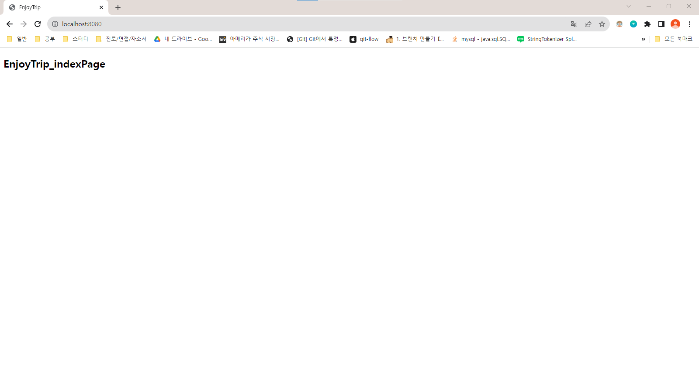

구현 기능: 회원가입
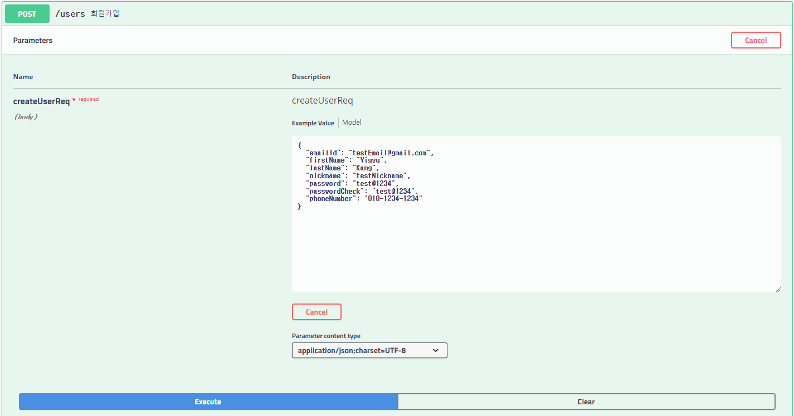
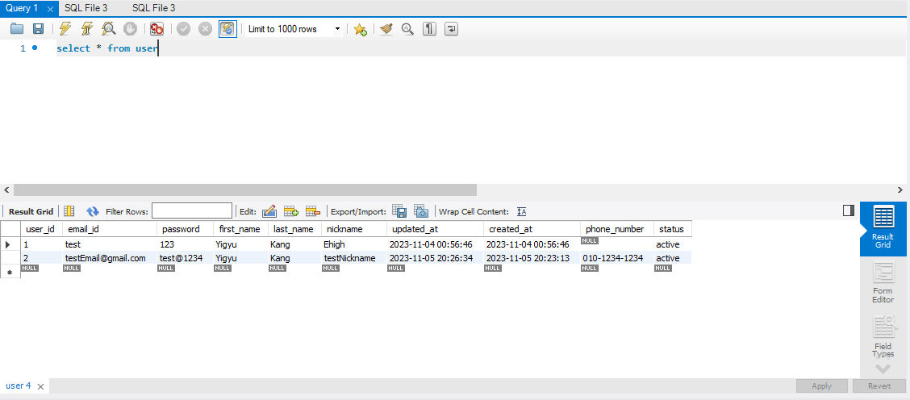

구현 기능: 회원정보수정
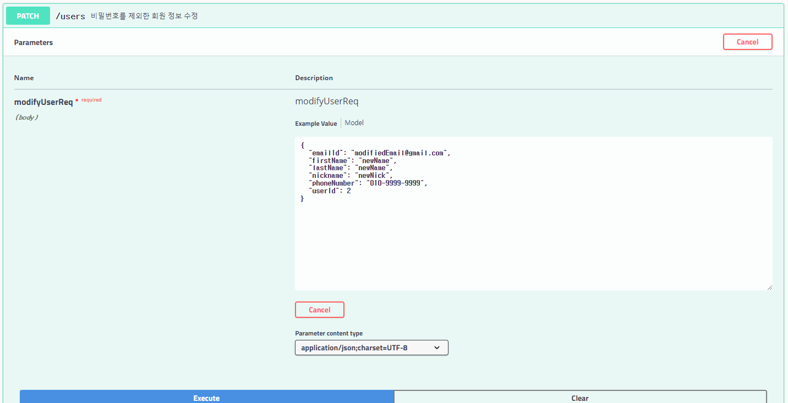
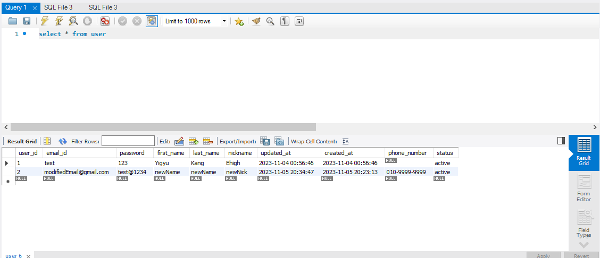

구현 기능: 회원탈퇴
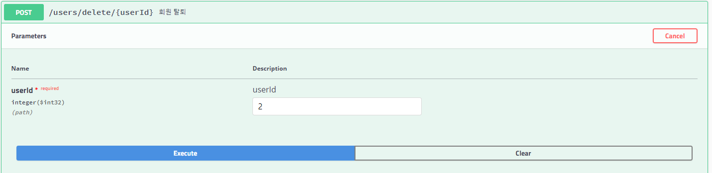
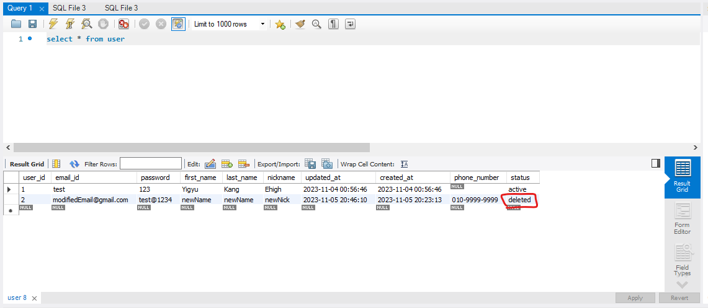

구현 기능: 회원 목록 조회
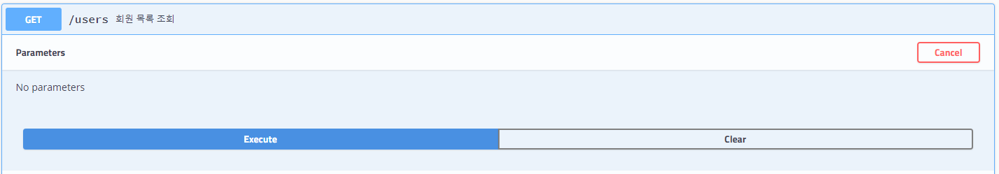
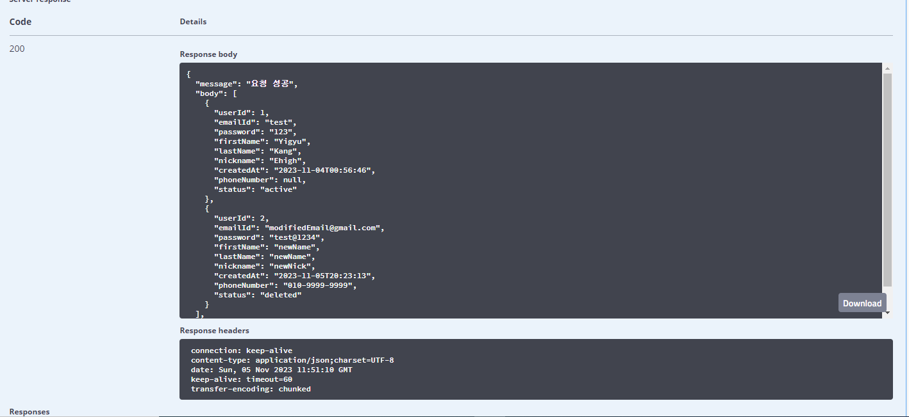

구현 기능: 단일 회원정보 조회
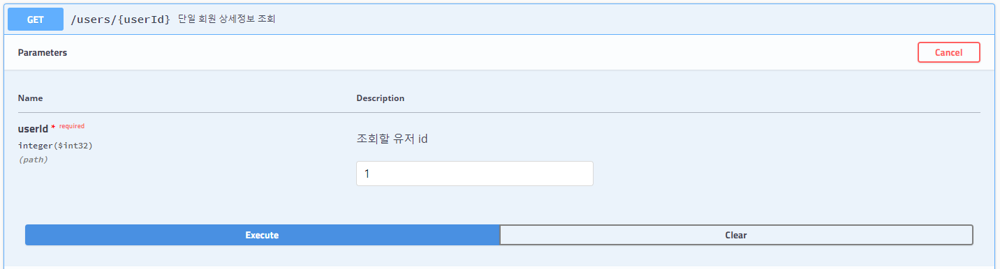
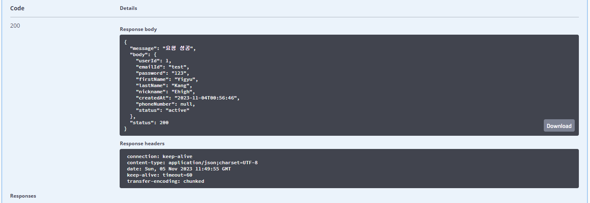

구현 기능: 로그인
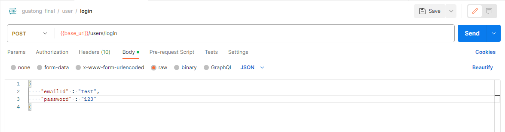
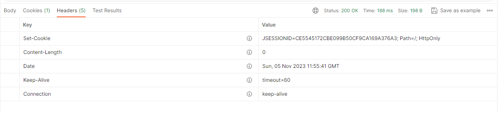

구현 기능: 로그아웃
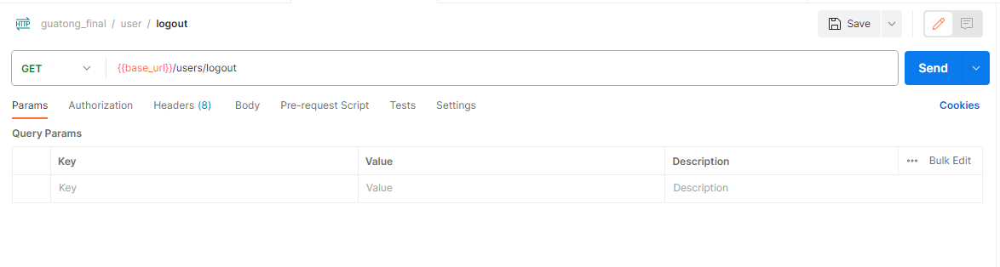
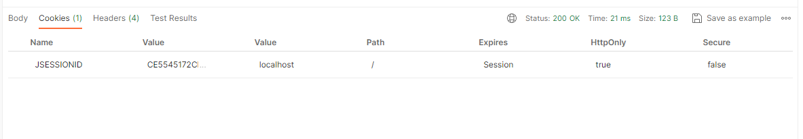

구현 기능: 관광지 전체검색

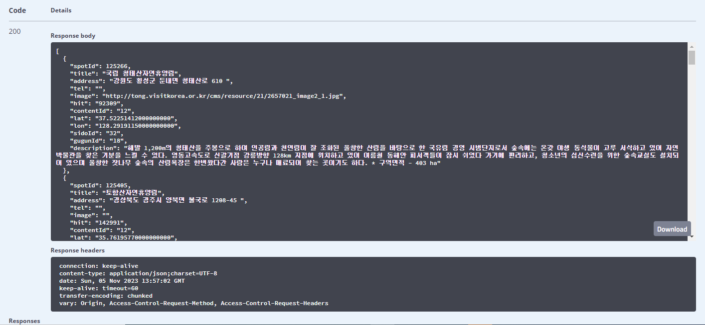

구현 기능: 관광지 상세조회
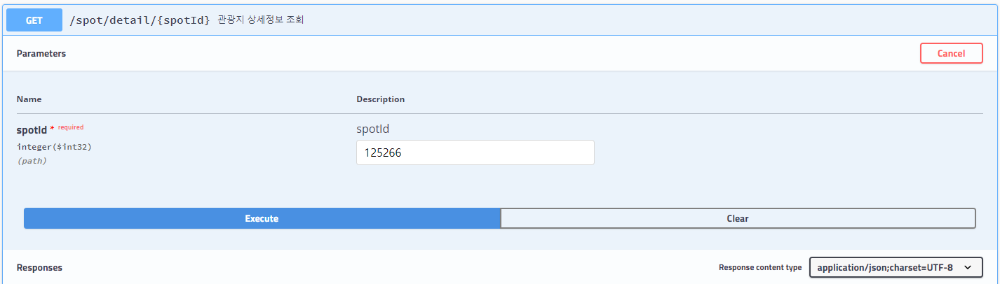
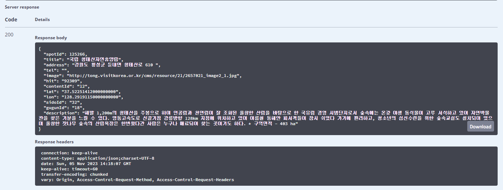

구현 기능: 관광지 지역별검색
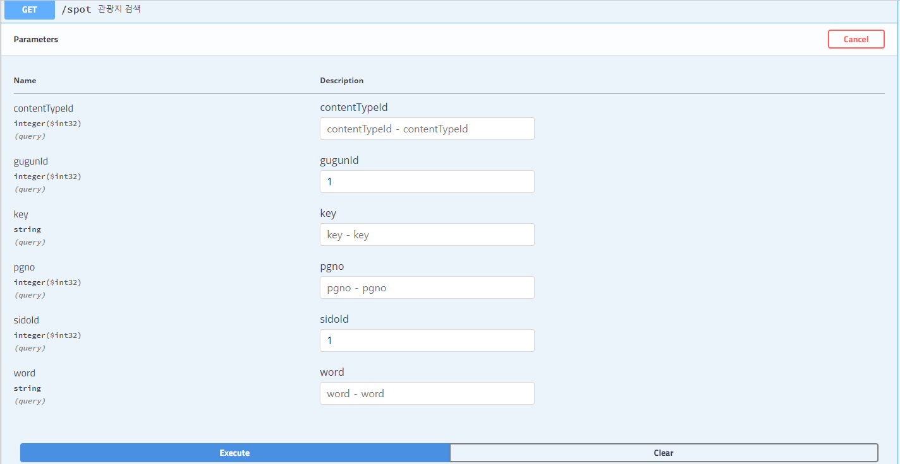
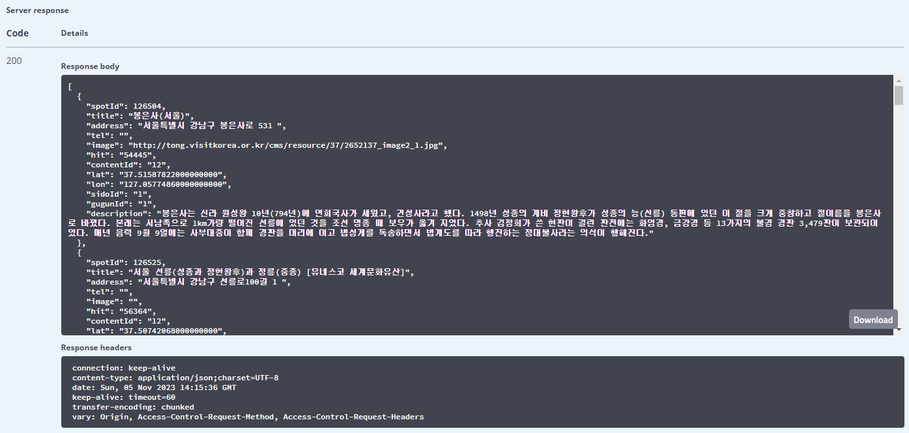

구현 기능: 관광지 타입별 검색
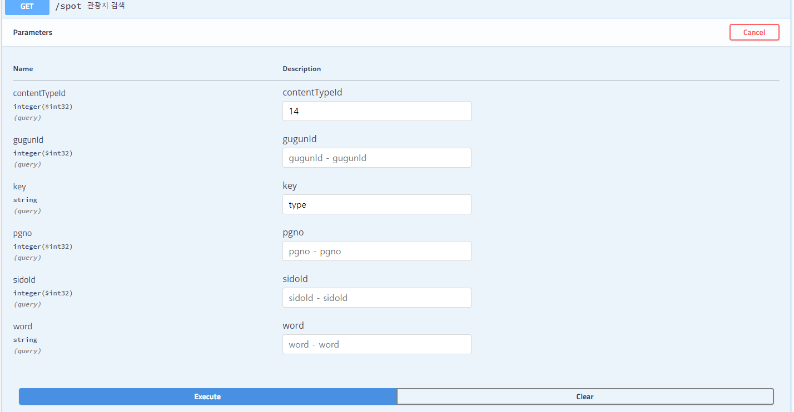
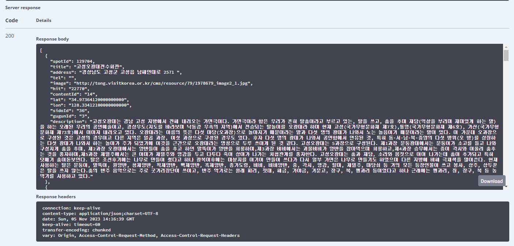

구현 기능: [추가] 여행계획관리
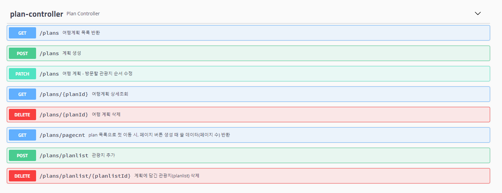

구현 기능: [심화] 게시판 관리
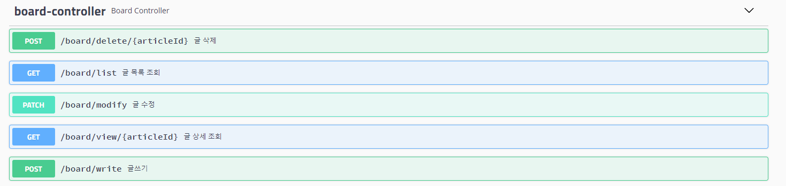
